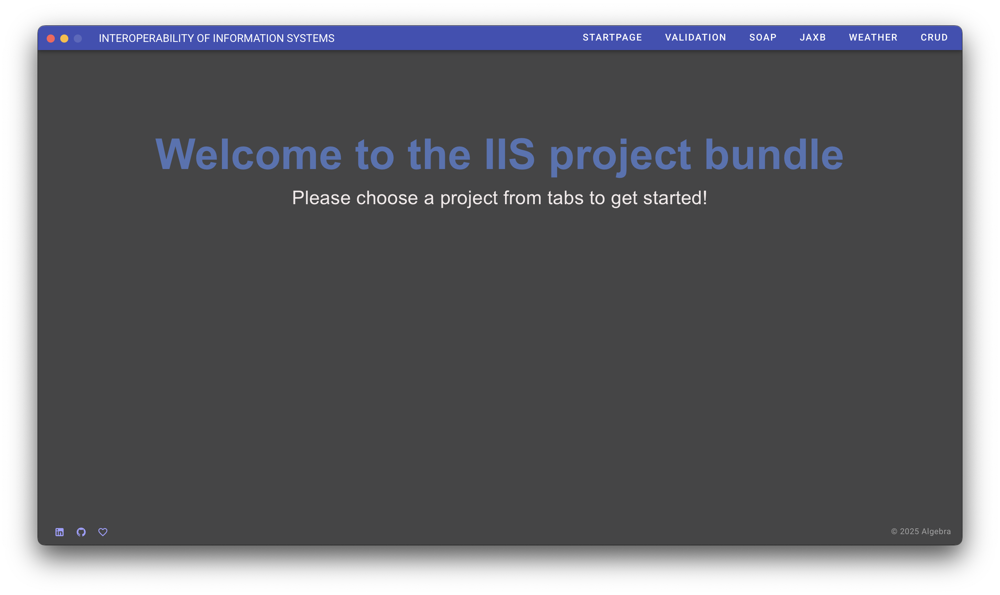
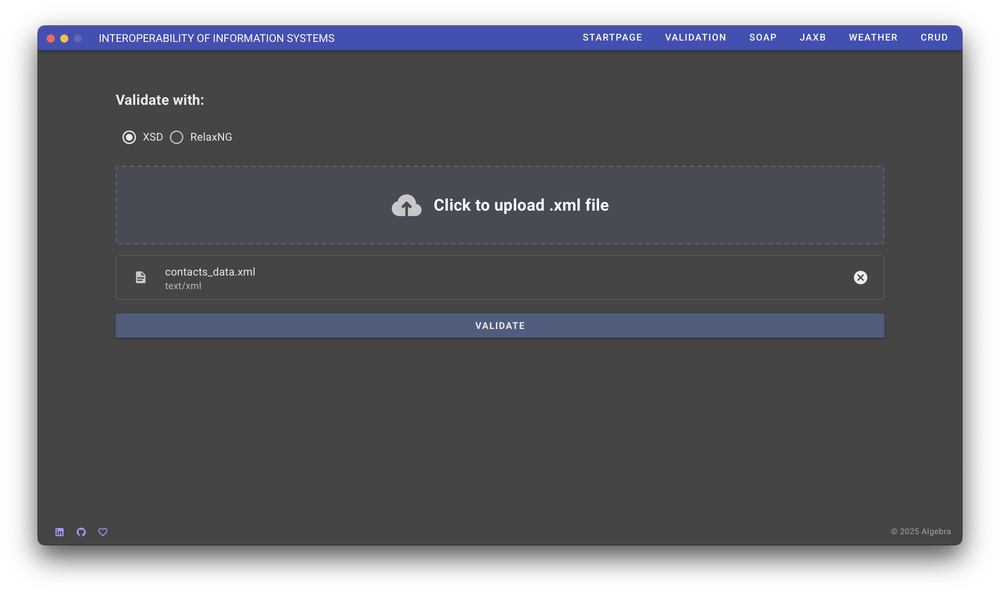
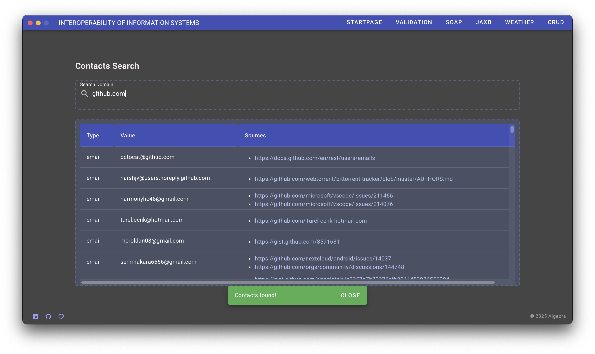
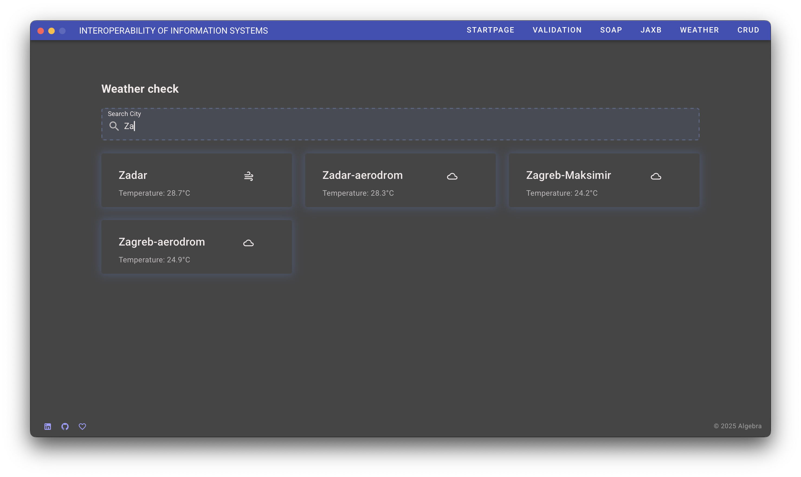
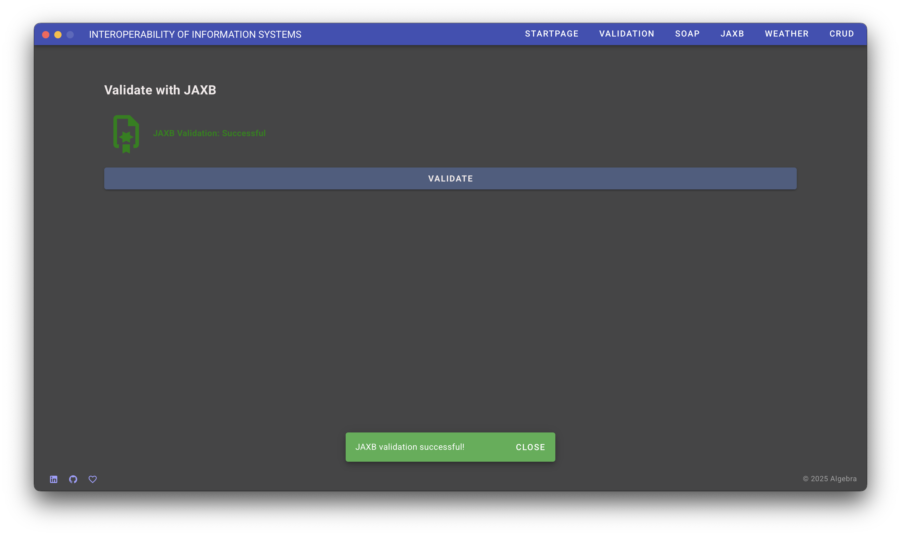
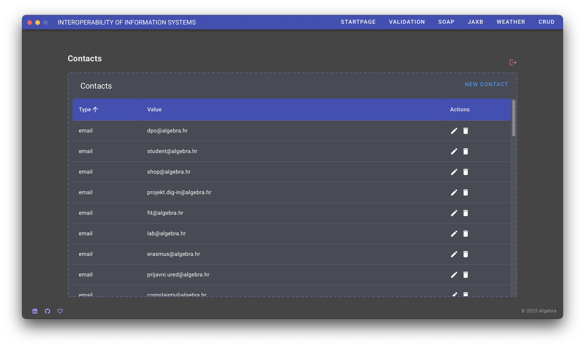
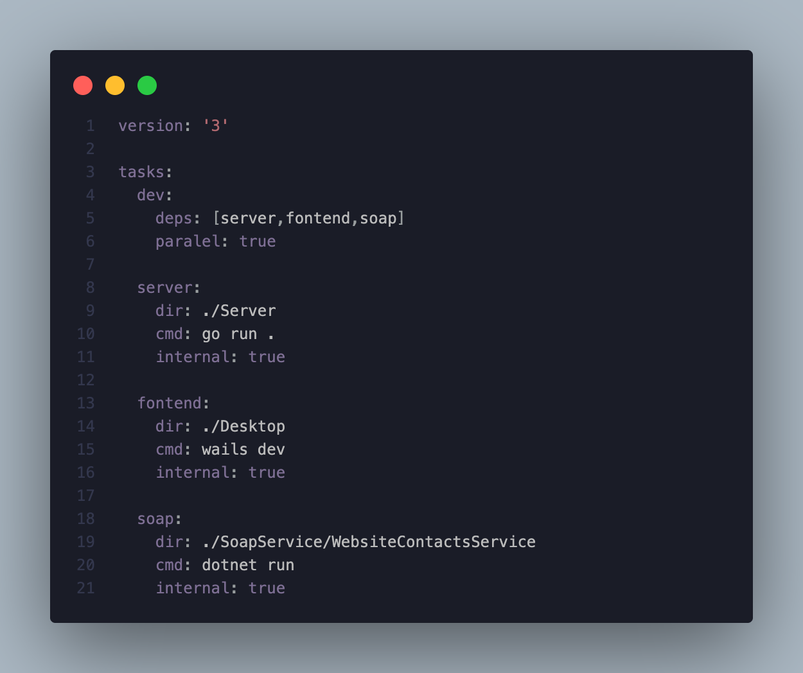

# IIS PROJECT

This project implements a backend and frontend system based on the RapidAPI "Website Contacts Scraper". It features REST API endpoints for submitting XML data (validated by XSD and RNG schemas), a SOAP interface for searching contact information from a generated XML file using XPath, and JAXB validation of this XML. Additionally, it includes an XML-RPC service to fetch current weather temperatures from DHMZ and a custom REST API secured with JWT for full CRUD operations, all accessible via a client desktop/web application.

## Project Overview

This project is a multi-component system featuring a desktop application, a backend server, a SOAP service, and a JAXB utility. The primary components are orchestrated using Task for streamlined development and execution.

## Program Showcase

<div style="overflow-x: auto; white-space: nowrap; padding: 10px 0; text-align: center;">
  
  
  
  
  
  
</div>

### Core Structure

Here's a high-level overview of the project's directory structure:

- **Desktop/**: Contains the Wails (Go + Vue.js) desktop application.
  - `api/`: Go backend logic for the Wails app.
  - `build/`: Build artifacts for the desktop app.
  - `frontend/`: Vue.js frontend code.
    - `src/assets/`: **(Place your images here)**
  - `app.go`: Wails application structure.
  - `main.go`: Main entry point for the Wails desktop application.
  - `wails.json`: Wails project configuration.
- **JaxbThing/**: A Java JAXB project, likely for XML processing.
  - `src/`: Java source code.
  - `xml-resources/`: XML schemas or related resources.
  - `build.xml`: Ant build file.
- **Server/**: The main backend Go server.
  - `handlers/`: HTTP request handlers.
  - `main.go`: Entry point for the Go server.
- **SoapService/**: A .NET SOAP web service.
  - `WebsiteContactsService/`: The service implementation.
- **taskfile.yaml**: Task configuration for building and running the project components.

*(For a more detailed, auto-generated structure, you can refer to `project_structure.md`)*

---

<div style="background-color: #FFF3E0; color: #E65100; border-left: 5px solid #FF9800; padding: 10px; margin-bottom: 15px;">
  <strong>Disclaimer:</strong> This project is best experienced and run on macOS. While other operating systems might work, macOS is the recommended environment for optimal performance and compatibility.
</div>

## Quick Start: Running Everything with `task dev`

This project uses [Task](https://taskfile.dev/) as a build tool and task runner. The `dev` task is configured to start all necessary services for a complete development environment.

1.  **Install Task:** If you haven't already, [install Task](https://taskfile.dev/installation/).
2.  **Navigate to Project Root:** Open your terminal and `cd` into the `/Users/lorena/Documents/algebra/projekti/iis_project/` directory.
3.  **Run the `dev` task:**
    ```bash
    task dev
    ```

This single command will:
- Start the Go backend **Server**.
- Launch the Wails **Desktop** application in development mode (which includes the Vue.js frontend).
- Run the .NET **SoapService**.

All services will run concurrently, and their output will be visible in your terminal.

---

## Key Components & Visuals

### 1. Task Orchestration (`taskfile.yaml`)

The `taskfile.yaml` defines how different parts of the project are built and run. The `dev` task, for example, depends on `server`, `frontend` (Wails app), and `soap` tasks.



### 2. Wails Desktop Application (`Desktop/main.go`)

The entry point for the Wails desktop application is `Desktop/main.go`. This file configures and launches the Wails app, bridging Go functions with the Vue.js frontend.


---

## Further Details

**(Optional: Add more sections as needed)**

### Prerequisites
- Go (version 1.24.1)
- Node.js (version 24.1.0), npm (version 11.3.0), and bun (version 1.2.4) (for the Wails frontend)
- .NET SDK (versions 7.0.410, 8.0.407)
- Java JDK (version 21.0.2)
- Task (version v3.42.1) (Task runner)

### Individual Component Commands
If you need to run components separately:
- **Backend Server:** `cd Server && go run main.go`
- **Wails Desktop App (Dev):** `cd Desktop && wails dev`
- **SOAP Service:** `cd SoapService/WebsiteContactsService && dotnet run`

### Building for Production
- **Wails Desktop App:** `cd Desktop && wails build`

### Backend Server Technology (Go + Gin)

The backend server located in the `/Server` directory is built using Go and the [Gin web framework](https://gin-gonic.com/). Gin is utilized for routing, request handling, and middleware management to provide the RESTful API services. Key aspects include:
- **Routing:** Defined in `Server/main.go` to map API endpoints to handler functions.
- **Handlers:** Located in `Server/handlers/`, these functions process incoming requests and generate responses for functionalities like contact management, data upload, authentication, and weather information.
- **Middleware:** Custom middleware, such as for JWT authentication, is implemented in `Server/handlers/middleware.go` to process requests before they reach the main handlers.

---

